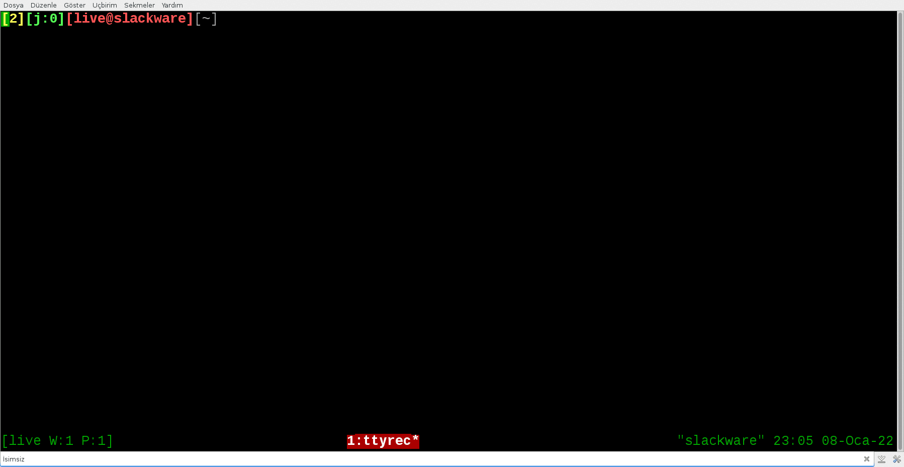

# openGLRefToMan

Scripts and patches for creating a Slackware 15.0 installation package from
manpages created by conversion of [official OpenGL Reference repository][openglrepo].

## Contents

* [Target User and Alternatives](#target-user-and-alternatives)
* [Building and Installation](#building-and-installation)
  - [Requirements](#requirements)
  - [Building](#building)
  - [Installation For Slackware 15.0](#installation-for-slackware-150)
  - [Installation For Other Distros](#installation-for-other-distros)
* [Removal](#removal)
  - [For Slackware 15.0](#for-slackware-142)
  - [For Other Distros](#for-other-distros)
* [Usage](#usage)
  - [From CLI](#from-cli)
  - [From vim](#from-vim)
* [Support](#support)
* [Roadmap](#roadmap)
* [Code of Conduct](#code-of-conduct)
* [Contributing](#contributing)
* [License](#license)
* [Project Status](#project-status)

## Target User and Alternatives

If you would like to have OpenGL API references as manpages this repo probably
presents the most readable and extensible solution (if you don't like my edits
on various manpages for increasing readability only thing you've to do is adding
your version of manpage into the **_corrected_manpages_** directory and building
by following the steps presented in the following section).

Alternatives that I'm aware of for the presented solution are as follows:
  1. A web scraped version of the official API reference repo presented [here][webscrapedOpenGLrepo].

     * Very nice project, can update everything as the official repo gets updated
       by rebuilding everything, but I need a solution that I could integrate into
       vim.

  2. An Ubuntu package is available named [opengl-4-man-doc][ubuntuOpenGLpackage].

     * Only GL4.1 API and has lots of unreadable pages, could not update manpages
       as the official repos gets updated.

  3. Also Arch-Linux has it's own packaged version as [opengl-man-pages][archOpenGLpackage].

     * As a Slackware user I cannot use this one but inspired me for the creation
       of everything presented in this repo.

## Building and Installation

Manpages can be build for all distros but a removable installation package
creation option is only presented for Slackware 15.0.

### Requirements

    Operating System: Linux

    Distro          : Slackware 15.0 (64-bit x86_64 edition) for removable package creation
                      Others                                 for only raw manpage creation

    Shell           : bash          ≥ 5.1.16

    Others          : GNU diffutils ≥ 3.8
                                           diff
                      GNU coreutils ≥ 9.0
                                           basename
                                           cp
                                           echo
                                           mkdir
                                           mv
                      GNU patch     ≥ 2.7.6
                      GNU sed       ≥ 4.8
                      man           ≥ 2.9.4
                      gzip          ≥ 1.11
                      git           ≥ 2.35.1
                      unzip         ≥ 6.00
                      xsltproc      compiled against libxml 20910

### Building

Manpages will be build as follows:

  1. Download or clone the [OpenGL repo][OpenGLrepo] if you didn't cloned this repo.

  2. Check the requirements of the [OpenGL repo][OpenGLrepo] stated in the file
  **README.adoc** and make sure that you've the required software.  
    For Slackware64 15.0 you can use following packages:  
    * [mathML2dtd](https://github.com/N-Tek/mathML2dtd)  
    * [docbookMathML1mods](https://github.com/N-Tek/docbookMathML1mods)  
    * [docbook5.0.0](https://github.com/N-Tek/docbook-5.0.0)  

  3. By using [OpenGLprocessRepo.sh](./SlackBuild/sources/scripts/OpenGLprocessRepo.sh) script
  convert DocBook xml sources to manpages (may take ≥30 minutes).

     All converted manpages will be located under the directory of **_man3/_**
     in the [OpenGL repo][OpenGLrepo]'s root directory, having following suffixes
     as gzip archives:

     | Description                                | Repo Directory | Manpage Suffix |
     | ------------------------------------------ | -------------- | -------------- |
     | OpenGL ES 1.1 (fixed function)             | es1.1          | 3GLesEarliest  |
     | OpenGL ES 2.0                              | es2.0          | 3GLesSecond    |
     | OpenGL ES 3.0                              | es3.0          | 3GLesThird     |
     | OpenGL ES 3.1                              | es3.1          | 3GLesFourth    |
     | OpenGL ES 3.x (latest ES, currently 3.2)   | es3            | 3GLesLatest    |
     | OpenGL 2.1 (including fixed functionality) | gl2.1          | 3GLearliest    |
     | OpenGL 4.x (latest GL, currently 4.5)      | gl4            | 3GLlatest      |

     Manpages under the directory of **_man3/_** can be checked with
     [OpenGLrefViewer.sh](./SlackBuild/sources/scripts/OpenGLrefViewer.sh) before and after patching
     (Steps 4 and 5).

  4. Create a directory to store patch files having '.diff' suffix.

  5. Create patch files having '.diff' suffix by using [OpenGLcreateManPatches.sh](./SlackBuild/sources/scripts/OpenGLcreateManPatches.sh)
  and edited manpage files presented under **_corrected_manpages/_** directory.

  6. patch existing manpages using newly created patch files by using
  [OpenGLpatchManPages.sh](./SlackBuild/sources/scripts/OpenGLpatchManPages.sh).

     Following directories will be created in the parent directory of **_man3/_**
     directory:
     * **_orig/_**     stores prepatched manpages as patch backup.
     * **_patched/_**  stores copies of patched manpages for checking with [viewer.sh](./scripts/viewer.sh).

### Installation For Slackware 15.0

By using **SlackBuild** script, **slack-desc** and **doinst.sh** file build manpages
automatically with the usage of related shell scripts and
create a removable package.

Manually install the package.

For detailed package creation and installation info check [here][slackbuildsHowTo].

As a result of installation newly created patched manpages will be automatically
copied into **/usr/man/** and _whatis_ database will be automatically updated
(original _whatis_ database will be backed with '.diff' suffix).

### Installation For Other Distros

Follow the building steps presented previously and manually execute related scripts
with required arguments.

Copy **_man3/_** directory to your distro's main manpage directory OR
create an installation package for your distro and install it.

Create a backup of your distro's '_whatis_' database(preferably with '.orig' suffix
and update it.

## Removal

### For Slackware 15.0

Remove package by using **_removepkg_** command as root. For further info check [here][slackwarePkgRmv].

Replace updated _whatis_ database with it's backup having '.orig' suffix.

### For Other Distros

If manually copied all manpages use the following command:
    `rm -iv *3GL*`
else
    check your distro's manual for package removal

Update '_whatis_' database of your distro.

## Usage

### From CLI

* To reach a manpage defined in single API from command-line-interface(CLI)
  use  
  `man FUNCTION_NAME`.

* To reach a manpage defined in multiple APIs from command-line-interface(CLI)
  use  
  `man -a FUNCTION_NAME`.

### From vim

* To reach a manpage defined in a single API from vim
  use  
  `:Man FUNCTION_NAME`.

* To reach a manpage defined in multiple APIs from vim
  use  
  `:Man -a FUNCTION_NAME`.

## Support

All types of constructive criticisms and contributions are welcome, and I'll
try my best for solving your problems related with the scripts and patches
presented in this repo as an engineering geologist, a self-learner and a guy
who enjoys coding.

For further info please check [SUPPORT.md](./SUPPORT.md).

## Roadmap

Essentially I've created this repo to solve my problem at the first place and
I've to admit I really have no idea in the beginning but with time I've learned
lots of stuff from the guys and the gals like myself who has tried to solve their
problems and decided to share their findings with other individuals who might
face similar problems. Remembering all of them individually at this point is
a bit hard for me so I've created this repo to show my graditude.

The next thing for this repo might be encouriging users of other distros for creation
of a similar packages for their preferred distros

and

entering the listed packages of [slackbuilds dot org](https://slackbuilds.org).

Additional ideas related with the future are welcomed.

## Code of Conduct

[Contributor Covenant version 2.1][CoC] is the effective code of conduct for this
project.

For further info please check [CODE_OF_CONDUCT.md](./CODE_OF_CONDUCT.md).

## Contributing

Please check [CONTRIBUTING.md](./CONTRIBUTING.md).

## License

Software presented in this repository is licensed with GPLv3.

For further info please check [COPYING](./COPYING).

## Project Status

This project is actively maintained by Necib ÇAPAR.

[webscrapedOpenGLrepo]: https://github.com/BSVino/docs.gl
[ubuntuOpenGLpackage]: https://packages.ubuntu.com/impish/opengl-4-man-doc
[archOpenGLpackage]: https://archlinux.org/packages/extra/any/opengl-man-pages/
[openglrepo]: https://github.com/KhronosGroup/OpenGL-Refpages
[slackbuildsHowTo]: https://slackbuilds.org/howto/
[slackwarePkgRmv]: slackbook.org/beta/#pkg_install-remove-upgrade
[CoC]: https://www.contributor-covenant.org/version/2/1/code_of_conduct.html
